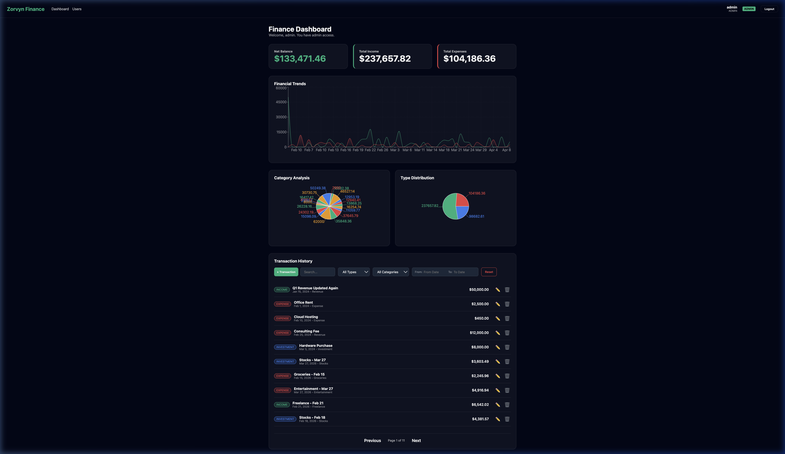
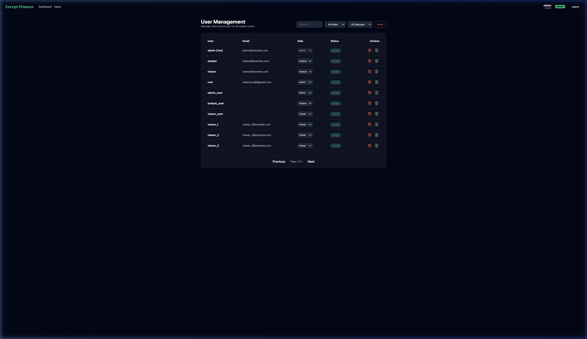
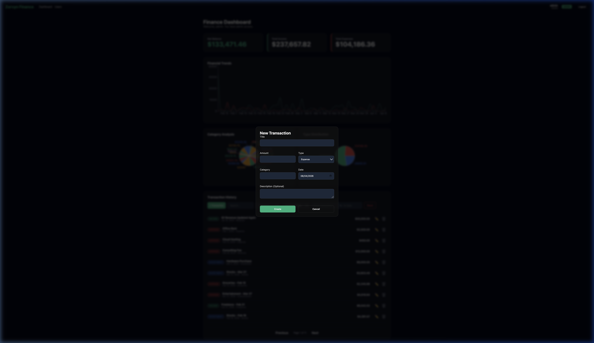
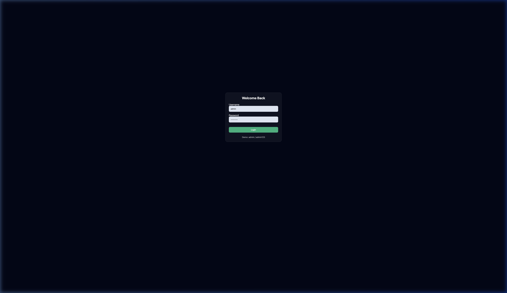

# Zorvyn Finance Dashboard Assessment

A modern, secure, and highly responsive Full-Stack Finance Dashboard built for analytical precision. This application demonstrates robust Role-Based Access Control (RBAC), sophisticated data visualization, and professional-grade backend validation.

---

## 🚀 Setup & Installation

### Prerequisites
- **Python**: 3.10 or higher
- **Node.js**: 18.0 or higher
- **npm**: 9.0 or higher

### 1. Backend Setup (Django)
```bash
cd backend
python3 -m venv venv
source venv/bin/activate  # On Windows: venv\Scripts\activate
pip install -r requirements.txt
python manage.py migrate
python manage.py createsuperuser  # Follow prompts to create an admin
python manage.py runserver
```
The backend will be available at `http://localhost:8000`.

### 2. Frontend Setup (React/Vite)
```bash
cd frontend
npm install
npm run dev
```
The frontend will be available at `http://localhost:5173`.

---

## 🖼 UI Preview

### 📊 Main Dashboard
The analytical hub showing categorical spending, financial trends, and the transaction engine.


### 👥 User Management
Administrative control center for managing team roles and system access.


### 💸 Transaction Entry
Streamlined, glassmorphic modal for logging new income and expenses.


### 🔐 Authentication
Secure, modern login and registration interface.


---

| Feature | Viewer | Analyst | Admin |
| :--- | :---: | :---: | :---: |
| **View Dashboard & Charts** | ✅ | ✅ | ✅ |
| **Search & Filter Transactions** | ✅ | ✅ | ✅ |
| **Create/Edit Transactions** | ❌ | ✅ | ✅ |
| **Delete Transactions** | ❌ | ❌ | ✅ |
| **View User List** | ❌ | ✅ | ✅ |
| **Modify User Roles/Status** | ❌ | ❌ | ✅ |

> [!NOTE]
> All permissions are enforced strictly at the API layer via Django REST Framework permissions and validated through object-level serializers.

---

## 🛠 API Overview

The backend exposes a RESTful API powered by **Django REST Framework (DRF)**.

### Authentication
- `POST /api/token/`: Obtain JWT access and refresh tokens.
- `POST /api/token/refresh/`: Refresh an expired access token.

### Financial Records
- `GET /api/records/`: List transactions with support for advanced filtering (search, category, date range).
- `POST /api/records/`: Create a new transaction (Analyst/Admin).
- `PUT/PATCH /api/records/{id}/`: Update an existing record.
- `GET /api/analytics/summary/`: Returns calculated net balance, income/expense totals, and daily trends.

### User Management
- `GET /api/users/`: List all system users (Analyst/Admin).
- `PATCH /api/users/{id}/`: Update user role or active status (Admin only).

---

## 🧠 Assumptions & Trade-offs

### Assumptions Made
1.  **Stateless Security**: Assumed that JWT is the preferred modern standard for this assessment to allow for potential future scalability.
2.  **Category Consistency**: Financial categories (Salary, Groceries, etc.) are currently managed as strings for flexibility, but could be migrated to a dedicated model for larger-scale applications.
3.  **Local Persistence**: SQLite was chosen for this assessment to ensure an "instant setup" experience for reviewers without requiring external database dependencies.

### Technical Trade-offs
- **Styling**: Chose **Vanilla CSS with Glassmorphism** over TailwindCSS to demonstrate deep control over UI aesthetics and prevent "generic" library looks.
- **Component Modularity**: Extracted logic into shared components (like `FilterBar`) to improve maintainability, even though the current app size is small.
- **Backend Validation**: Implemented custom global exception handling and object-level serializer validation to ensure business logic (e.g., no negative amounts) is enforced at the API layer, not just the UI.

---

## ✅ Key Features Demonstrated
- **Advanced Filtering**: Range-based date selectors and multi-field search logic.
- **Dynamic Charts**: Interactive Area and Pie charts using Recharts.
- **Robust Error Handling**: Standardized JSON error responses and database-level protection.
- **Professional Refactoring**: Clean, modular React code with centralized utility formatters.
